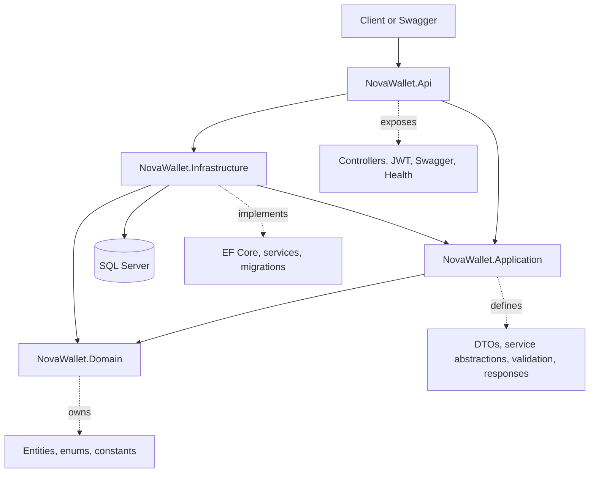
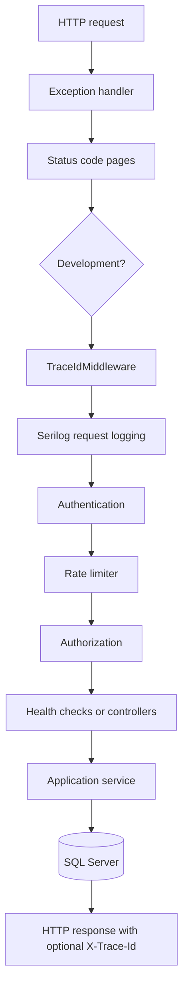
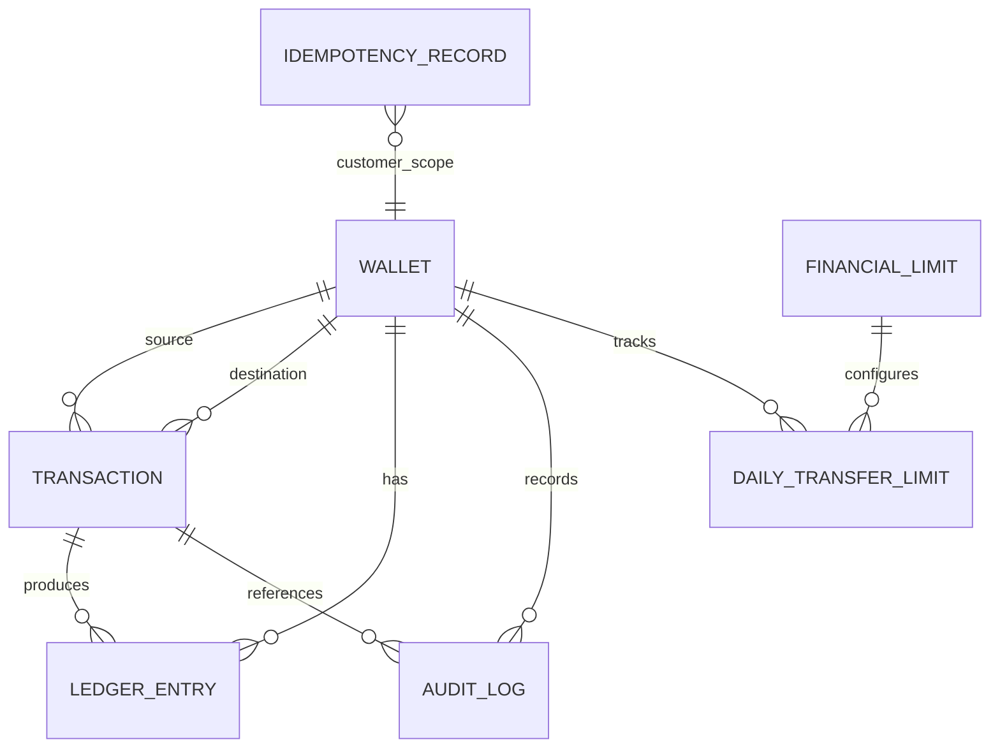
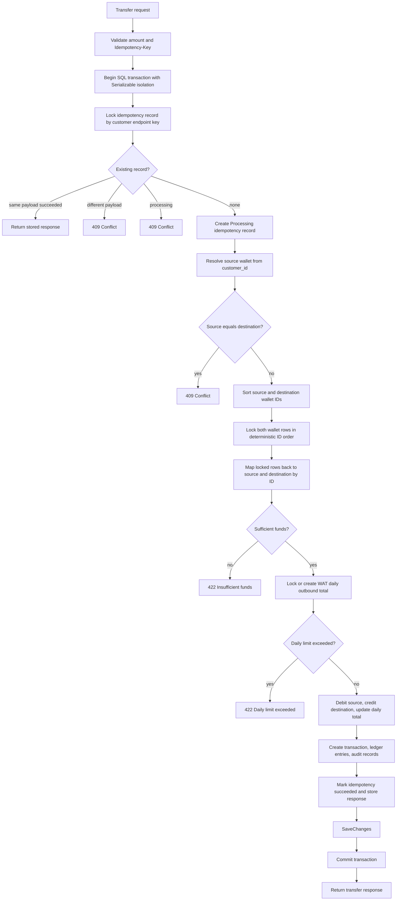
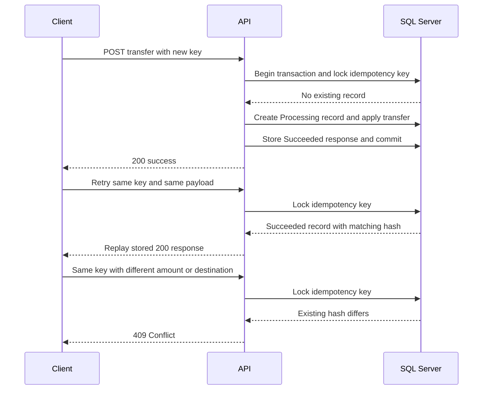
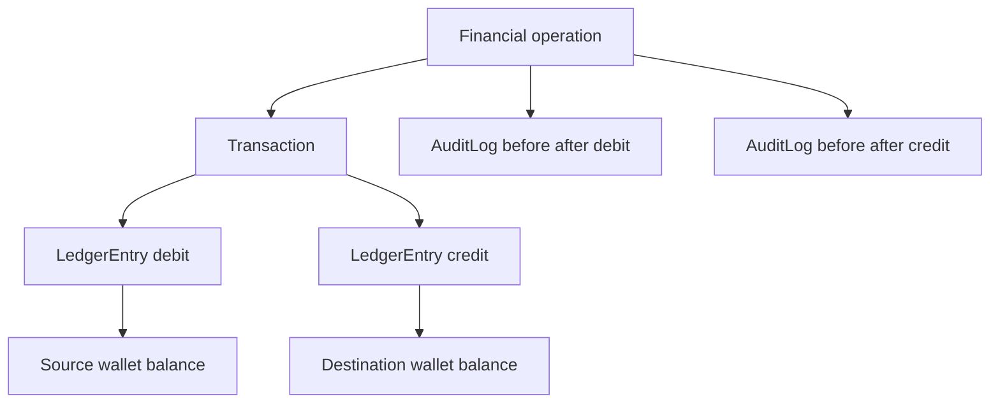
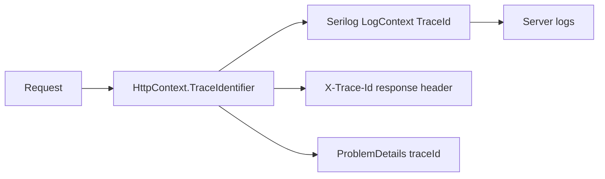

# NovaWallet Ledger Service

## 1. Overview

NovaWallet is an ASP.NET Core wallet ledger API for creating customer wallets, retrieving balances, simulating inbound wallet funding, transferring money between wallets, and viewing wallet statements.

The service is designed around financial correctness rather than only CRUD behavior. It uses integer kobo amounts, SQL Server transactions, row/update locking, idempotency records, daily outbound transfer limits, audit records, JWT bearer authentication, and real SQL Server integration tests to protect wallet balances under concurrent requests.

## Quick Start

Start the complete NovaWallet service from the repository root:

```bash
docker compose up --build
```

Once the API and SQL Server are running:

- Swagger UI: `http://localhost:8080/swagger`
- Liveness: `http://localhost:8080/health/live`
- Readiness: `http://localhost:8080/health/ready`

The API is available on host port `8080`. For the complete setup instructions, testing guide, and end-to-end Swagger walkthrough, see the detailed sections below.

### Demo Roles & Permissions

Normal customer operations do not require a privileged role. Wallet ownership is determined from the authenticated JWT `customer_id` claim.

```json
{
  "customerId": "CUST01",
  "roles": []
}
```

This token can be used for CUST01's normal customer operations, such as creating/retrieving their wallet, transferring from their wallet, and viewing their statement.

```json
{
  "customerId": "nip-simulator-001",
  "roles": ["nip_simulator"]
}
```

This token can be used to test the privileged inbound wallet credit endpoint: `POST /api/wallets/{walletId}/credits`.

| Role | Purpose | Can do | Cannot do |
| --- | --- | --- | --- |
| `nip_simulator` | Simulates an external NIP/system funding actor. | Satisfies `PrivilegedWalletCredit` and can call `POST /api/wallets/{walletId}/credits`. | Does not bypass wallet ownership rules for normal customer operations. |
| `system` | Represents a trusted system actor for the same privileged credit policy. | Satisfies `PrivilegedWalletCredit` and can call `POST /api/wallets/{walletId}/credits`. | Does not bypass all authorization. |
| `admin` | Represents an administrative actor for the same privileged credit policy. | Satisfies `PrivilegedWalletCredit` and can call `POST /api/wallets/{walletId}/credits`. | Does not have unrestricted access or "do everything" permissions. |

Authentication verifies who the caller is. The `customer_id` claim establishes customer wallet ownership. Roles authorize privileged operations such as inbound wallet credit.

## 2. Requirements Implemented

| Requirement | Status | Implementation summary |
| --- | --- | --- |
| Wallet creation | Implemented | One NGN wallet per authenticated `customer_id`, starting at zero balance. |
| Balance retrieval | Implemented | Authenticated customers retrieve only their own wallet. |
| Simulated inbound NIP credit | Implemented | Privileged roles can credit a wallet and generate transaction, ledger, and audit records. |
| Wallet-to-wallet transfer | Implemented | Authenticated customer transfers from their own wallet to another wallet. |
| Statements | Implemented | Ledger-backed, paginated, newest-first statement endpoint. |
| Integer money model | Implemented | Financial amounts use integer kobo as `long` and SQL `bigint`. |
| Concurrency safety | Implemented | SQL transactions, deterministic wallet lock ordering, and update locks protect balances. |
| Idempotency | Implemented | Required `Idempotency-Key` for transfers, persisted in SQL with canonical request hashing. |
| Daily outbound transfer limit | Implemented | SQL-backed per-wallet WAT-day outbound aggregate. |
| Audit trail | Implemented | Separate audit records for committed wallet balance mutations. |
| Audit immutability | Implemented | Enforced at the EF Core persistence boundary. |
| JWT authentication and roles | Implemented | Bearer JWT, `customer_id` claim, privileged credit policy. |
| Docker Compose startup | Implemented | API and SQL Server containers with startup migration support. |
| Transfer rate limiting | Implemented | Fixed-window transfer limiter, 20 requests/minute/customer. |
| Structured logging and trace IDs | Implemented | Serilog plus `X-Trace-Id` and ProblemDetails `traceId`. |
| Health checks | Implemented | `/health/live` and `/health/ready`; readiness checks database connectivity. |
| Transactional outbox/event publishing | Not implemented | Left as a production evolution option because no external event delivery requirement is implemented. |

## 3. Engineering Goals and Correctness Invariants

The financial architecture is built around invariants that must hold even when multiple requests arrive at the same time.

| Invariant | Design mechanism | Verification |
| --- | --- | --- |
| Wallet balance must not become negative. | Source wallet ownership check, row/update lock, sufficient-funds check under lock, checked arithmetic, database check constraint. | Transfer and concurrency tests. |
| Successful transfer must debit source and credit destination atomically. | One SQL transaction contains wallet updates, daily total, transaction, ledger, audit, and idempotency completion. | Transfer integration tests. |
| Failed financial operation must not leave partial committed state. | Mutations are saved and committed only after all validations and record creation succeed. | Integration tests for validation, insufficient funds, missing destination, and daily limit. |
| Monetary values remain integer kobo. | `long` in domain/API models and SQL `bigint` in persistence. | Unit tests and source review. |
| Same idempotent transfer request must not mutate balances twice. | SQL-backed idempotency record stores request hash and serialized success response. | Replay and concurrent same-key tests. |
| Same idempotency key with different intent is rejected. | Canonical hash of destination wallet and amount is compared for existing key. | Conflict test. |
| Daily outbound limit remains correct under concurrency. | Daily aggregate participates in the transfer transaction and is locked before update. | Daily limit concurrency test. |
| Committed balance mutations produce ledger/audit records. | Credit and transfer services create transaction, ledger, and audit records in the same persistence flow. | Credit, transfer, ledger, and audit tests. |
| Audit records are not mutable/deletable through application persistence. | `NovaWalletDbContext` rejects modified/deleted `AuditLog` entries during `SaveChanges`. | Audit immutability tests. |
| Customers transfer only from their own wallet. | Source wallet is resolved from authenticated `customer_id`, not supplied by the client. | Statement and transfer ownership behavior. |

The chain is intentional:

```text
Requirement -> Invariant -> Service design -> SQL transaction/constraint -> Automated test
```

## 4. Architecture

### 4.1 Architecture at a Glance



### 4.2 Layer Responsibilities

| Layer | Responsibility |
| --- | --- |
| `NovaWallet.Api` | HTTP controllers, authentication, authorization, Swagger, ProblemDetails, health checks, trace middleware, request pipeline, and current-customer access. |
| `NovaWallet.Application` | Service contracts, request/response models, shared response types, validation helpers, and application-facing abstractions. |
| `NovaWallet.Domain` | Core wallet entities, enums, constants, error codes, role names, and financial limit codes. |
| `NovaWallet.Infrastructure` | EF Core DbContext, SQL Server configurations, migrations, service implementations, demo token generation, audit service, and financial limit lookup. |

Controllers are deliberately thin. They translate HTTP concerns into application calls and leave financial state changes to the service/persistence layer, where database transactions and locks are available.

### 4.3 Request Pipeline

The pipeline in `Program.cs` is:



Authentication runs before rate limiting because the transfer limiter partitions requests by the authenticated `customer_id` claim. Without authentication first, the limiter could not reliably apply a per-customer partition.

### 4.4 Why This Architecture?

| Problem | Decision | Why | Alternative / simpler approach | Trade-off |
| --- | --- | --- | --- | --- |
| Keep HTTP concerns separate from financial consistency logic. | Layered API/Application/Domain/Infrastructure solution. | Controllers remain small and financial rules stay close to persistence and transactions. | Put all logic directly in controllers. | Slightly more project structure, but clearer ownership. |
| Avoid unnecessary abstractions over EF Core. | Use DbContext directly in infrastructure services. | EF Core already provides unit-of-work and change tracking behavior. | Add generic repository and Unit of Work wrappers. | Less indirection; service is more explicitly tied to EF Core. |
| Keep the assessment focused on ledger correctness. | Avoid CQRS, MediatR, event sourcing, and microservice boundaries. | The bounded problem is a single ledger service with strong SQL consistency needs. | Add more architectural patterns. | Less ceremony; production eventing can be added later if required. |

### 4.5 Project Structure

```text
NovaWallet/
  src/
    NovaWallet.Api/
      Controllers/
      Health/
      Middleware/
      Startup/
    NovaWallet.Application/
      Abstraction/
      Common/
      Models/
      Validation/
    NovaWallet.Domain/
      Constants/
      Entities/
      Enums/
    NovaWallet.Infrastructure/
      Persistence/
      Services/
  tests/
    NovaWallet.UnitTests/
    NovaWallet.IntegrationTests/
  Dockerfile
  docker-compose.yml
  NovaWallet.sln
```

## 5. Domain and Persistence Model

### 5.1 Core Entities

| Entity | Purpose |
| --- | --- |
| `Wallet` | Customer wallet with one currency, current balance, and creation timestamp. |
| `Transaction` | Financial operation record for credit or transfer, including source/destination wallet references and reference string. |
| `LedgerEntry` | Wallet-specific debit/credit entry with amount and resulting balance after the operation. |
| `DailyTransferLimit` | Per-wallet, per-WAT-day outbound total used to enforce daily transfer limits. |
| `FinancialLimit` | Configurable financial limit table; currently seeds the daily outbound transfer limit. |
| `IdempotencyRecord` | SQL-backed transfer idempotency state, request hash, and stored response. |
| `AuditLog` | Balance mutation audit record with before/after balances and actor. |

### 5.2 Data Relationship Diagram



This diagram shows the important relationships conceptually. `IdempotencyRecord` is scoped by customer id, endpoint, and key rather than a direct foreign key to `Wallet`.

### 5.3 Database Constraints as a Safety Layer

| Table/entity | Constraint or index |
| --- | --- |
| `Wallets` | Unique `CustomerId`; `BalanceKobo >= 0`; `BalanceKobo` stored as `bigint`. |
| `Transactions` | `AmountKobo > 0`; source/destination wallet foreign keys use `NoAction`; indexes on reference, created time, source/time, destination/time. |
| `LedgerEntries` | `AmountKobo > 0`; `BalanceAfterKobo >= 0`; indexes on transaction and wallet/time. |
| `AuditLogs` | `AmountKobo >= 0`; before/after balances non-negative; indexes on wallet, transaction, and created time. |
| `DailyTransferLimits` | Composite key on `WalletId, WatDate`; outbound total non-negative. |
| `FinancialLimits` | Unique `Code`; positive `AmountKobo`; seeded daily outbound transfer limit. |
| `IdempotencyRecords` | Unique customer/endpoint/key index; key, customer, endpoint, request hash, and status are required. |

Application checks provide understandable business errors. Database constraints provide a final consistency layer if application logic is bypassed or races occur.

## 6. Money Representation

All financial values in the service use integer kobo represented as `long` in C# and `bigint` in SQL Server. Repository inspection found no `decimal`, `double`, or `float` usage in the `src` financial path.

Examples:

| Kobo | NGN value |
| ---: | ---: |
| `100` | NGN 1.00 |
| `10_000` | NGN 100.00 |
| `25_050` | NGN 250.50 |
| `100_000` | NGN 1,000.00 |

Problem: floating-point money can introduce rounding ambiguity.

Decision: represent API and database money amounts in the minor unit, kobo.

Why: addition, subtraction, comparison, persistence, and idempotency hashing remain exact and unambiguous.

Trade-off: API clients must send and display minor units correctly, but the ledger avoids fractional arithmetic surprises.

## 7. Wallet Lifecycle

### 7.1 Wallet Creation

The customer identity comes from the JWT `customer_id` claim. `POST /api/wallets` creates one NGN wallet for that customer with `BalanceKobo = 0`.

A unique database index on `Wallet.CustomerId` enforces one wallet per customer. Wallet creation also writes a zero-amount `wallet_created` audit record.

### 7.2 Balance Retrieval

`GET /api/wallets/me` resolves the wallet from the authenticated `customer_id`. The client does not provide a wallet id for balance retrieval, so a customer cannot request another customer's wallet through this endpoint.

### 7.3 Simulated Inbound NIP Credit

`POST /api/wallets/{walletId}/credits` simulates external inbound funding. It is restricted to privileged roles because customers should not be able to create money by crediting themselves.

For credits:

- `SourceWalletId` is `null` because the money is modeled as an external inbound credit.
- `DestinationWalletId` is the credited wallet.
- the wallet row is selected with `UPDLOCK, ROWLOCK`;
- checked arithmetic protects overflow;
- transaction, ledger, and audit records are created;
- changes are saved within a database transaction.

## 8. Transfer Architecture and Concurrency Safety

### 8.1 Transfer Processing Flow



### 8.2 Transaction Boundary

Transfers use `IsolationLevel.Serializable`. The following changes participate in one database transaction:

- idempotency record creation/completion;
- source wallet debit;
- destination wallet credit;
- daily outbound aggregate update;
- transaction record;
- two ledger entries;
- two audit records.

If validation fails before commit, the transfer state is not partially committed.

### 8.3 The Concurrency Problem

A simple check such as:

```csharp
if (balance >= amount)
```

is not enough under concurrency. Two requests can both read the same balance, both decide funds are sufficient, and then both debit. The sufficient-funds decision must be made after the relevant wallet row is locked.

### 8.4 Why SQL Locks Instead of a C# Lock

A C# lock only coordinates threads inside one API process. SQL Server is the shared consistency boundary for the wallet rows. Database locking remains meaningful if multiple API instances connect to the same SQL Server database.

### 8.5 Deterministic Lock Ordering

Opposite-direction transfers create a common deadlock pattern if each request locks its source first:

```text
Without deterministic order:
Transfer A: lock Wallet A, wait for Wallet B
Transfer B: lock Wallet B, wait for Wallet A
```

NovaWallet sorts the two wallet IDs and locks them in that deterministic order:

```text
With deterministic order:
Transfer A: lock lower wallet ID, then higher wallet ID
Transfer B: lock lower wallet ID, then higher wallet ID
```

The business direction of the transfer does not determine lock order. Wallet IDs determine lock order. After both rows are locked, the implementation maps the locked rows back to source and destination by ID before applying debit and credit.

### 8.6 SQL Locking Strategy

| Mechanism | Where used | Purpose |
| --- | --- | --- |
| `Serializable` | Transfer transaction | Prevents anomalies around idempotency and daily aggregate decisions. |
| `UPDLOCK` | Wallet, idempotency, and daily limit reads | Takes update locks for rows that may be changed. |
| `HOLDLOCK` | Idempotency record lookup | Holds the range lock for the serializable idempotency check. |
| `ROWLOCK` | Wallet and daily limit reads | Requests row-level locks. SQL Server may still choose another lock strategy. |

### 8.7 Preventing Negative Balances

Negative balances are prevented by multiple layers:

- source wallet is resolved from authenticated customer identity;
- source and destination wallet rows are locked before mutation;
- sufficient funds are checked under lock;
- arithmetic is performed in checked contexts;
- `Wallets.BalanceKobo >= 0` exists as a database check constraint;
- failures roll back the SQL transaction.

### 8.8 Trade-off

Pessimistic locking can reduce throughput when many transfers contend for the same wallet, but it gives explicit consistency behavior that is appropriate for this assessment. A production system might also evaluate optimistic concurrency with rowversion, depending on contention profile and retry strategy.

## 9. Idempotency

### 9.1 Problem

Clients may retry a transfer because of a timeout, double-click, network failure, or concurrent duplicate submission. Without idempotency, the same business intent could debit a wallet more than once.

### 9.2 Request Contract

Transfers require an `Idempotency-Key` header. The service trims the key and requires it to be present and no more than 128 characters.

### 9.3 Canonical Payload Identity

The request hash is built from:

```text
destinationWalletId:D + ":" + amountKobo
```

The hash intentionally uses canonical business fields instead of raw JSON. This avoids treating insignificant JSON formatting differences as different transfer intent.

### 9.4 Idempotency Sequence



### 9.5 Concurrency Safety

Idempotency is enforced by:

- unique index on customer, endpoint, and key;
- `Serializable` transfer transaction;
- `UPDLOCK, HOLDLOCK` lookup for the idempotency record;
- same transaction for financial mutation and idempotency completion.

### 9.6 Atomicity

The transfer and idempotency completion are committed together. That matters because a stored successful idempotency response must correspond to an actual committed transfer.

An in-memory dictionary would not provide the same restart behavior, multi-instance behavior, or database atomicity.

## 10. Daily Outbound Transfer Limit

Daily outbound transfer limits are separate from HTTP rate limits.

| Control | Purpose |
| --- | --- |
| Financial daily limit | Controls how much money can leave a wallet per WAT day. |
| HTTP transfer rate limit | Controls how frequently transfer requests can hit the API. |

The configured seeded daily outbound limit is `50_000_000` kobo, which is NGN 500,000.00.

`FinancialLimit` stores the configured amount. `DailyTransferLimit` stores each wallet's outbound total for a WAT date. WAT is calculated as UTC+1, and a new `WatDate` naturally creates a new daily aggregate.

During transfer processing, the daily aggregate is locked or created inside the same transaction as the debit and credit. If the new outbound total would exceed the configured limit, the transfer is rejected with `422`.

## 11. Transaction, Ledger and Audit Architecture



| Record | Question it answers |
| --- | --- |
| `Transaction` | What financial operation occurred? |
| `LedgerEntry` | What debit/credit affected this wallet and what was its resulting balance? |
| `AuditLog` | What balance mutation occurred, including before/after state and actor? |

These are separate because they serve different query and control needs. A transfer is one financial transaction but two wallet ledger entries and two balance mutation audit records.

### 11.1 Audit Trail

Audit records are created for:

- wallet creation;
- inbound credit;
- transfer debit from the source wallet;
- transfer credit to the destination wallet.

### 11.2 Audit Immutability

Audit immutability is enforced at the application's EF Core persistence boundary. `NovaWalletDbContext` rejects modified or deleted `AuditLog` entries in `SaveChanges` and `SaveChangesAsync`.

This is appropriate for application-level protection in the assessment. It is not the same as database-level immutable storage, triggers, append-only database permissions, or WORM storage.

## 12. Statements

`GET /api/wallets/me/statements` returns the authenticated customer's own wallet history from ledger entries joined to transactions.

Statement behavior:

- newest-first ordering by created time and ledger entry id;
- pagination with default `page = 1` and `pageSize = 20`;
- `pageSize` must be between 1 and 100;
- includes transaction id, reference, transaction type, direction, amount, balance after, counterparty wallet id, and timestamp;
- debit entries use destination wallet as counterparty;
- credit entries use source wallet as counterparty, which is `null` for external inbound credits.

## 13. Authentication and Authorization

NovaWallet uses JWT bearer authentication. Customer ownership is based on the `customer_id` claim. Demo tokens also include `sub` with the same customer id.

The development-only demo token endpoint accepts:

```json
{
  "customerId": "CUST01",
  "roles": []
}
```

Privileged example:

```json
{
  "customerId": "nip-simulator-001",
  "roles": ["nip_simulator"]
}
```

Privileged roles:

- `nip_simulator`
- `system`
- `admin`

| Operation | Anonymous | Customer | Privileged |
| --- | --- | --- | --- |
| Create wallet | 401 | Allowed | Allowed |
| Get own wallet | 401 | Allowed | Allowed |
| Transfer | 401 | Allowed | Allowed |
| Statement | 401 | Allowed | Allowed |
| Credit wallet | 401 | 403 | Allowed |

Inbound credit is privileged because it simulates external/system funding. Normal customers should not be able to mint balance.

## 14. Error Handling

Successful responses use `ApiSuccess<T>`:

```json
{
  "status": true,
  "message": "Wallet retrieved successfully.",
  "data": {}
}
```

Application errors are returned as RFC7807-style `ProblemDetails` with:

- `type`
- `title`
- `status`
- `detail`
- `instance`
- `errorCode`
- `traceId`

Verified status semantics:

| Status | Typical scenario |
| --- | --- |
| `400` | Validation failure, missing `customer_id`, invalid amount, missing/invalid idempotency key, invalid statement paging. |
| `401` | Protected endpoint without valid bearer token. |
| `403` | Authenticated customer attempts privileged credit without required role. |
| `404` | Wallet not found, destination not found, demo token endpoint outside Development. |
| `409` | Wallet already exists, same-wallet transfer, idempotency conflict or in-progress duplicate. |
| `422` | Insufficient funds, daily outbound limit exceeded, money overflow. |
| `429` | Transfer rate limit exceeded. |

## 15. Resilience and Operational Features

### 15.1 Transfer Rate Limiting

The transfer endpoint uses ASP.NET Core built-in rate limiting:

- endpoint: `POST /api/wallets/transfers`;
- policy: `TransferRateLimit`;
- algorithm: fixed window;
- limit: 20 requests per minute;
- partition: authenticated `customer_id`, falling back to `anonymous`;
- queue: `QueueLimit = 0`;
- rejection status: `429`.

The in-memory limiter is suitable for the single-instance assessment setup. A distributed limiter or API gateway policy would be needed for coordinated enforcement across multiple API instances.

### 15.2 Structured Logging and Trace Correlation



`TraceIdMiddleware` reuses ASP.NET Core's `HttpContext.TraceIdentifier` as the canonical request trace id. The same value is pushed into Serilog `LogContext`, returned in `X-Trace-Id`, and included in ProblemDetails errors.

This keeps correlation simple without inventing a second identifier. OpenTelemetry/distributed tracing is not implemented.

### 15.3 Health Checks

| Endpoint | Meaning | Dependency behavior |
| --- | --- | --- |
| `GET /health/live` | API process is alive. | Does not check SQL Server. |
| `GET /health/ready` | API is ready to serve traffic. | Uses EF Core `Database.CanConnectAsync` through `NovaWalletDbHealthCheck`. |

Liveness and readiness are separate so orchestration can distinguish "process is up" from "required dependency is available."

## 16. API Endpoint Reference

| Method | Endpoint | Authentication/role | Purpose |
| --- | --- | --- | --- |
| `POST` | `/api/auth/demo-token` | Anonymous, Development only | Generate a demo JWT. |
| `GET` | `/api/auth/demo-token/roles` | Anonymous, Development only | List demo privileged roles. |
| `POST` | `/api/wallets` | Authenticated | Create wallet for current customer. |
| `GET` | `/api/wallets/me` | Authenticated | Retrieve current customer's wallet. |
| `POST` | `/api/wallets/{walletId}/credits` | Authenticated plus `nip_simulator`, `system`, or `admin` | Simulate inbound credit to wallet. |
| `POST` | `/api/wallets/transfers` | Authenticated; rate limited | Transfer from current customer's wallet to another wallet. |
| `GET` | `/api/wallets/me/statements` | Authenticated | Retrieve paginated wallet statement. |
| `GET` | `/health/live` | Anonymous | Liveness check. |
| `GET` | `/health/ready` | Anonymous | Readiness/database check. |

## 17. Running NovaWallet

### 17.1 Prerequisites

Primary Docker workflow:

- Docker Desktop or Docker Engine with Compose.

Local development workflow:

- .NET 9 SDK;
- Docker Desktop or a reachable SQL Server instance for integration tests and local database use.

### 17.2 Primary Docker Startup

From the repository root:

```powershell
docker compose up --build
```

Docker Compose starts:

- `api`, built from the repository `Dockerfile`;
- `sqlserver`, using `mcr.microsoft.com/mssql/server:2022-latest`;
- SQL Server health check before API startup;
- automatic EF Core migrations through `DatabaseMigrationHostedService`;
- persistent SQL Server volume `sqlserver-data`.

The API listens on host port `8080`.

### 17.3 URLs

| Purpose | URL |
| --- | --- |
| Swagger UI | `http://localhost:8080/swagger` |
| Liveness | `http://localhost:8080/health/live` |
| Readiness | `http://localhost:8080/health/ready` |

### 17.4 Stopping

Stop containers without deleting data:

```powershell
docker compose down
```

Delete the SQL Server volume only when you intentionally want a fresh database:

```powershell
docker compose down -v
```

### 17.5 Local Development

Restore, build, and test locally:

```powershell
dotnet restore NovaWallet.sln --configfile NuGet.Config
dotnet build NovaWallet.sln --no-restore
dotnet test NovaWallet.sln --no-build
```

Integration tests require Docker because they use SQL Server through Testcontainers.

## 18. End-to-End Swagger Walkthrough

Open `http://localhost:8080/swagger`.

1. Generate a normal customer token:

   `POST /api/auth/demo-token`

   ```json
   {
     "customerId": "CUST01",
     "roles": []
   }
   ```

2. Copy `data.accessToken`.

3. Authorize Swagger with the token.

4. Create CUST01 wallet:

   `POST /api/wallets`

5. Generate a privileged token:

   `POST /api/auth/demo-token`

   ```json
   {
     "customerId": "nip-simulator-001",
     "roles": ["nip_simulator"]
   }
   ```

6. Authorize Swagger with the privileged token.

7. Credit CUST01 wallet. Copy CUST01's returned wallet id into:

   `POST /api/wallets/{walletId}/credits`

   ```json
   {
     "amountKobo": 100000
   }
   ```

   `100000` kobo is NGN 1,000.00.

8. Re-authorize Swagger with the CUST01 token.

9. Check balance:

   `GET /api/wallets/me`

10. Generate a normal token for CUST02:

    ```json
    {
      "customerId": "CUST02",
      "roles": []
    }
    ```

11. Authorize as CUST02 and create CUST02 wallet:

    `POST /api/wallets`

12. Re-authorize as CUST01 and perform a transfer to CUST02. Add the header:

    ```text
    Idempotency-Key: demo-transfer-001
    ```

    Body:

    ```json
    {
      "destinationWalletId": "copy-CUST02-wallet-id-here",
      "amountKobo": 25050
    }
    ```

    `25050` kobo is NGN 250.50.

13. Replay the exact same request with the same idempotency key and same body. The stored success response should be returned and the balance should not be debited a second time.

14. Send the same key with a different amount. The service should return `409 Conflict`.

15. Retrieve CUST01 statements:

    `GET /api/wallets/me/statements`

16. Authorize as CUST02 and retrieve CUST02 statements to observe the credit-side ledger entry and balance-after behavior.

17. Optional authorization check: authorize as a normal customer and attempt `POST /api/wallets/{walletId}/credits`. The expected result is `403 Forbidden`.

## 19. Testing Strategy

The latest verified local run after Docker was available passed:

```text
56 total
56 passed
0 failed
0 skipped
```

This statement reflects the local verification run, not the restricted documentation environment.

### 19.1 Unit Tests

Unit tests cover:

- NGN wallet defaults;
- daily transfer limit amount representation;
- credit and transfer amount validation;
- integer kobo formatting.

### 19.2 Integration Tests

Integration tests use the API host with SQL Server through Testcontainers. They exercise HTTP behavior, EF Core persistence, SQL Server constraints, transactions, and concurrency behavior.

### 19.3 Why Real SQL Server Matters

The most important correctness tests depend on SQL Server transaction isolation, update locks, constraints, and concurrent write behavior. EF Core InMemory cannot faithfully prove these database semantics, so real SQL Server integration testing is intentional.

### 19.4 Important Test Scenarios

The integration suite covers:

- wallet creation and duplicate conflict;
- wallet retrieval and not-found behavior;
- privileged credit;
- forbidden credit for normal customers;
- transaction, ledger, and audit records for credits;
- concurrent credits;
- transfers and resulting balances;
- transfer transaction and ledger records;
- audit records for both transfer sides;
- insufficient funds;
- missing destination wallet;
- same-wallet transfer rejection;
- daily limit exceeded and exact-limit success;
- concurrent same-source transfers;
- concurrent daily limit enforcement;
- opposite-direction transfers;
- missing idempotency key;
- idempotent replay;
- same key with different payload;
- concurrent same-key transfer;
- same key scoped to different customers;
- statements, pagination, ordering, ownership, and empty history;
- audit insert/update/delete behavior;
- health checks;
- transfer rate limiting;
- trace id headers and ProblemDetails trace id.

### 19.5 Running Tests

With Docker running:

```powershell
dotnet restore NovaWallet.sln --configfile NuGet.Config
dotnet build NovaWallet.sln --no-restore
dotnet test NovaWallet.sln --no-build
```

## 20. Key Engineering Decisions and Trade-offs

| Decision | Choice | Why | Trade-off / production consideration |
| --- | --- | --- | --- |
| Monetary representation | Integer kobo as `long`/`bigint` | Exact arithmetic and persistence. | Clients must understand minor units. |
| Database | SQL Server | Supports transactions, constraints, and locking semantics used by the service. | Requires SQL Server for meaningful integration verification. |
| Transfer consistency | SQL transaction with serializable isolation | Keeps debit, credit, daily limit, ledger, audit, and idempotency completion atomic. | More locking under contention. |
| Balance concurrency | SQL update locks | Protects shared wallet rows at the authoritative data boundary. | Pessimistic locking can reduce throughput. |
| Lock ordering | Deterministic wallet ID order | Reduces opposite-direction deadlock risk. | Requires careful remapping to source/destination by ID. |
| Idempotency | SQL-backed records | Survives process restarts and participates in the transfer transaction. | Requires extra table and cleanup strategy in production. |
| Daily financial limit | SQL-backed WAT aggregate | Enforced transactionally with wallet debit. | Time-zone assumption must remain explicit. |
| Audit | Separate audit model | Keeps balance mutation evidence distinct from ledger and transaction records. | Stronger immutability would require database/operational controls. |
| Persistence abstraction | EF Core DbContext directly | EF already supplies unit-of-work behavior. | Less portable to a different ORM. |
| Integration testing | SQL Server Testcontainers | Proves locking, constraints, and transaction behavior against the target database. | Requires Docker. |
| Rate limiting | Built-in fixed window | Simple and sufficient for single-instance assessment. | Distributed enforcement would need gateway/distributed storage. |
| Trace correlation | `HttpContext.TraceIdentifier` | One canonical id appears in logs, headers, and errors. | Not full distributed tracing. |
| Health readiness | Database connectivity check | Distinguishes live process from ready dependency state. | More dependencies can be added as operational needs grow. |
| Transactional outbox | Not implemented | No reliable external event publishing requirement exists in the current service. | Add if external events become required. |

## 21. Requirement-to-Implementation Traceability

| Requirement | Implementation mechanism | Verification |
| --- | --- | --- |
| Balance never negative | Row locking, sufficient-funds check, checked arithmetic, database constraint. | Transfer/concurrency tests. |
| Atomic transfer | One SQL transaction around wallet, daily total, transaction, ledger, audit, and idempotency changes. | Transfer integration tests. |
| Integer kobo | `long` models and SQL `bigint`. | Unit tests and source review. |
| Idempotency | SQL record, canonical hash, locking, stored response replay. | Replay and concurrent idempotency tests. |
| Daily outbound limit | `FinancialLimit` plus `DailyTransferLimit`. | Daily limit and concurrent limit tests. |
| Audit | Separate `AuditLog` plus EF persistence guard. | Audit completeness and immutability tests. |
| JWT ownership | Bearer middleware and `customer_id` claim. | Protected endpoint behavior and ownership tests. |
| Statements | Ledger query with pagination and own-wallet filter. | Statement tests. |
| Rate limiting | ASP.NET Core fixed-window limiter on transfer endpoint. | Rate limit tests. |
| Trace correlation | `TraceIdMiddleware`, Serilog LogContext, ProblemDetails extension. | Trace id tests. |
| Health checks | Live and ready endpoints with DB readiness check. | Health tests. |
| Single startup path | Docker Compose API and SQL Server with migrations on startup. | Documented run command. |

## 22. Production Evolution

Reasonable production evolution would include:

- managed secret storage and environment-specific configuration;
- real identity provider instead of the development demo-token issuer;
- TLS termination and reverse proxy configuration;
- distributed or gateway-backed rate limiting for multiple API instances;
- database-level audit controls if stronger immutability is required;
- OpenTelemetry and metrics if operational requirements justify them;
- cleanup/retention policy for idempotency records;
- transactional outbox if reliable external event publishing is introduced.

These are not claimed as current features. They are natural next steps for a production multi-instance financial system.

## 23. Assumptions

| Assumption | Current implementation |
| --- | --- |
| One wallet per customer | Enforced by unique `CustomerId` index. |
| Currency | NGN only through `CurrencyCodes.Ngn`. |
| Customer identity | JWT `customer_id` claim identifies wallet ownership. |
| Inbound credit | Simulates external NIP/system funding and is privileged. |
| API money unit | Request/response amounts use kobo. |
| Daily limit time zone | WAT calculated as UTC+1. |
| Daily outbound limit | Seeded as `50_000_000` kobo. |
| Demo tokens | Development-only helper for local assessment/demo use. |

## 24. AI-Assisted Development

AI-assisted development tools were used. Generated output was reviewed, corrected where necessary, and verified with automated tests rather than accepted blindly.

Detailed disclosure is provided separately in `AI_USAGE.md`.
